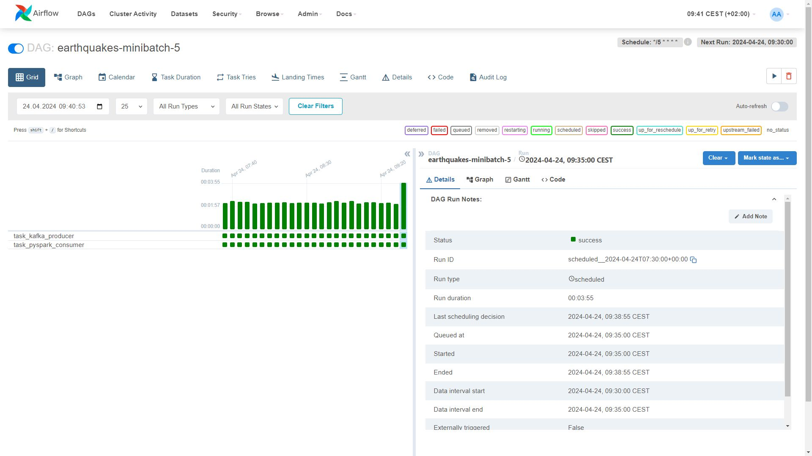

# [Plug & Play] Earthquakes - minibatch 
## Objective

This repository contains the final project for the [Data Engineering Zoomcamp](https://github.com/DataTalksClub/data-engineering-zoomcamp) course provided by [DataTalks.Club](https://datatalks.club/).

The primary objective of this project is to put into practice the knowledge and skills acquired throughout the course. The focus lies on constructing a robust data pipeline employing [Apache Airflow](https://airflow.apache.org/docs/apache-airflow/stable/index.html) in conjunction with [Apache Kafka](https://kafka-python.readthedocs.io/en/master/), [PySpark](https://spark.apache.org/docs/latest/api/python/index.html), and [PostgreSQL](https://www.postgresql.org/). The architectural overview of the project is depicted in the diagram below, providing a high-level perspective of the system's design and interactions.


Building upon the earlier components, including the utilization of [Apache Airflow](https://airflow.apache.org/docs/apache-airflow/stable/index.html) for orchestration, [Apache Kafka](https://kafka-python.readthedocs.io/en/master/) for real-time data streaming, [PySpark](https://spark.apache.org/docs/latest/api/python/index.html) for data processing, and [PostgreSQL](https://www.postgresql.org/) for data storage, this project aims to demonstrate the seamless integration of these technologies to facilitate efficient data ingestion, processing, and data analysis.


## Data source

The data being used for this project comes from a publicly available provider, namely, the U.S. Geological Survey (USGS). The USGS, as outlined on its 'About Us' page, serves as the science arm of the Department of the Interior, offering a diverse range of earth, water, biological, and mapping data and expertise to support decision-making on environmental, resource, and public safety issues. Established by an act of Congress in 1879, the USGS continuously adapts its scientific endeavors to address the evolving needs of society.

Aligned with its mission, the USGS provides access to an Application Programming Interface (API) that offers information about the history of earthquakes, free of charge. This API facilitates access to up-to-date earthquake data, including recent events. For specific details regarding the frequency of earthquake data updates, please refer to the relevant [page](https://www.usgs.gov/faqs/how-quickly-earthquake-information-posted-usgs-website-and-sent-out-earthquake-notification) on the USGS website.

The convenience of the data being updated quite frequently aligns with my concept for the development of a so-called minibatch data pipeline. As previously mentioned, data is retrieved via API using Apache Kafka, transformed using PySpark, and ingested into a PostgreSQL table. Ultimately, this data is visualized using Streamlit, contributing to a comprehensive analysis and understanding of seismic activity trends.

In addition to the described data pipeline components, two separate Airflow Directed Acyclic Graphs (DAGs) are utilized. The first DAG operates on a minibatch basis with a 5-minute interval, while the second DAG is a daily batch process.

The minibatch DAG orchestrates the retrieval of seismic data at a regular 5-minute interval. This interval-based approach ensures near-real-time ingestion of recent earthquake events into the pipeline. Each minibatch of data is processed and transformed before being ingested into the designated PostgreSQL table.

Meanwhile, the daily DAG is responsible for monitoring and handling potential late entries that may have been missed during the day. This DAG performs a daily check to identify any such late entries and appends them to the same PostgreSQL table used for the minibatch data. By consolidating these late entries with the regular minibatch data, the pipeline ensures comprehensive and up-to-date seismic data records within a single table.

Overall, these two Airflow DAGs work in tandem to maintain the integrity and timeliness of seismic data ingestion, offering a robust solution for continuous data processing and analysis.

### Applied technologies

| Name             | Scope                             | Description                                                                                                            |
| ----------------| ---------------------------------| ---------------------------------------------------------------------------------------------------------------------- |
| Docker Desktop   | Continuous integration, local development, containerization         | Docker Desktop is a platform that enables the development, shipping, and running of applications within containers. |
| Apache Airflow  | Workflow orchestration, automation, task scheduling, monitoring | Apache Airflow is an open-source platform used for programmatically authoring, scheduling, and monitoring workflows. |
| Apache Kafka    | web service                       | Apache Kafka is a distributed event streaming platform, commonly employed for building real-time streaming data pipelines and web services. |
| PySpark          | Data transformation, and analytics       | PySpark is a Python library that provides APIs for performing large-scale data processing and analysis, especially suitable for parallel and distributed computing tasks. |
| PostgreSQL      | RDBMS                              | PostgreSQL is an open-source relational database management system (RDBMS) known for its reliability, robustness, and extensive feature set, commonly used for storing structured data. |
| Streamlit       | web service                        | Streamlit is an open-source app framework designed for creating custom web applications tailored for machine learning and data science projects, facilitating easy deployment and sharing of data-driven applications. |
| black           | Python code formatting            | black is a Python code formatter that ensures a consistent and readable code style by applying strict rules automatically during code formatting processes. |
| isort           | Python import sorting             | isort is a Python library used for sorting Python imports within a file, ensuring a consistent and organized import order according to predefined configuration settings. |

Project Structure
------------

    ├── .streamlit/
    │
    ├── airflow_resources/
    │   ├── config/
    │   ├── dags/
    │   │   └── src/
    |   ├── logs/
    │   └── plugins/
    │
    ├── kafka/
    │   ├── config/
    │   └── data/
    │       ├── __cluster_metadata-0/
    │       └── earthquakes-0/
    │
    ├── scripts/
    │
    ├── spark/
    │
    ├── src/
    │   ├── kafka_client/
    │   └── spark_pgsql/
    │
    ├── static/

## Reproducibility

### Pre-requisties

* Python 3.9 or above
* Docker Desktop
* allowed virtualization in BIOS

### Project Setup Guidelines

To ensure reproducibility and set up your project environment, follow these guidelines:

1. **Virtual Environment Setup**:
   - Create a virtual environment named `.venv` using Python's built-in `venv` module:
     ```
     python -m venv .venv
     ```
   - Activate the virtual environment using the appropriate command based on your operating system:
     - For Windows:
       ```
       source .venv/Scripts/activate
       ```
     - For Unix/Mac:
       ```
       source .venv/bin/activate
       ```

2. **Upgrade Pip**:
   - Ensure you have the latest version of pip installed within the virtual environment:
     ```
     python -m pip install --upgrade pip
     ```

3. **Install Project Dependencies**:
   - Install project dependencies listed in the `requirements.txt` file:
     ```
     pip install -r requirements.txt
     ```

4. **Docker Setup**:
   - Create a Docker network named `airflow-kafka` to facilitate communication between services:
     ```
     docker network create airflow-kafka
     ```
   - Verify the creation of the Docker network:
     ```
     docker network ls
     ```

5. **Environment Variables Setup**:
   - Create an environment configuration file named `.env` with the necessary environment variables for Airflow:
     ```
     echo -e "AIRFLOW_UID=$(id -u)\nAIRFLOW_PROJ_DIR=\"./airflow_resources\"" > .env
     ```
    Add POSTGRES_PASSWORD="" to .env, along with password you use to connect to PostgreSQL.
6. **Kafka Setup**:
   - Start Kafka services using Docker Compose:
     ```
     docker-compose up
     ```

7. **Airflow Setup**:
   - Start Airflow services using the specified Docker Compose configuration:
     ```
     docker-compose -f docker-compose-airflow.yaml up
     ```

8. **Spark Setup**:
   - Build the Spark image with the provided Dockerfile, remeber to replace the PostgreSQL password:
     ```
     docker build -f spark/Dockerfile -t earthquakes/spark:latest --build-arg POSTGRES_PASSWORD=admin .
     ```
   - Clean up any previous versions of the Spark image if needed:
     ```
     docker rmi earthquakes/spark:latest
     ```

9. **PostgreSQL**
   - Remember to create a table in PostgreSQL using the schema stored under scripts/earthquakes.sql.

10. **Run Streamlit Dashboard**:
    - Execute the Streamlit dashboard script located at `./scripts/dashboard.py`:
      ```
      streamlit run ./scripts/dashboard.py
      ```


If above steps will fail try to use setup.sh script:
   - Ensure the setup script `setup.sh` is executable:
     ```
     chmod +x setup.sh
     ```
   - Run the setup script to perform any additional setup tasks:
     ```
     ./setup.sh
     ```
To shutdown all Docker images use shutdown.sh script:
   - Ensure the setup script `shutdown.sh` is executable:
     ```
     chmod +x shutdown.sh
     ```
   - Run the setup script to perform any additional setup tasks:
     ```
     ./shutdown.sh
     ```

Following these steps will help you establish a reproducible environment and set up your project for development or deployment.

### Check if everything works as intended: 

Please use the screenshots below to visually validate if all of the steps/processes are working fine.

Once the Kafka and Airflow images are up and running, the Docker Desktop view of a container should look as shown in the screenshot below.


```
For Airflow try: localhost:8080
```
After logging in to Airflow with airflow/airflow credentials, we should be able to find and activate the following DAGs:


Minibatch DAG will continue pulling the data from the API every 5 minutes.



The Kafka messages collected under the topic 'earthquakes' can be visually assessed using Kafka UI.
```
For Kafka UI try: localhost:8000
```


Each time the PySpark script is run, a new image will be pulled. The image is up and running only during the processing of the PySpark script. Check `DockerOperator()` in DAGs for mote details.


The screenshot below shows exemplary data entries pulled from the API using Airflow DAGs.


Finally, the Streamlit application shows the data stored as a PostgreSQL table as a couple of charts. New entries are taken into account every 5 minutes, naturally, only if any earthquakes during that time interval were reported.


Hopefully, you were able to make all the pieces work together. Hopefully, you now feel empowered to do Data Engineering on your own. Happy coding :)

### Peer review criterias - a self assassment:
* Problem description
    * 4 points: Problem is well described and it's clear what the problem the project solves
* Cloud
    * 0 points: Cloud is not used, things run only locally
* Data ingestion (choose either batch or stream)
    * Batch / Workflow orchestration
        * 4 points: End-to-end pipeline: multiple steps in the DAG, uploading data to data lake
* Data warehouse
    * 2 points: Tables are created in DWH, but not optimized
* Transformations (dbt, spark, etc)
    * 4 points: Tranformations are defined with dbt, Spark or similar technologies
* Dashboard
    * 4 points: A dashboard with 2 tiles
* Reproducibility
    * 4 points: Instructions are clear, it's easy to run the code, and the code works
